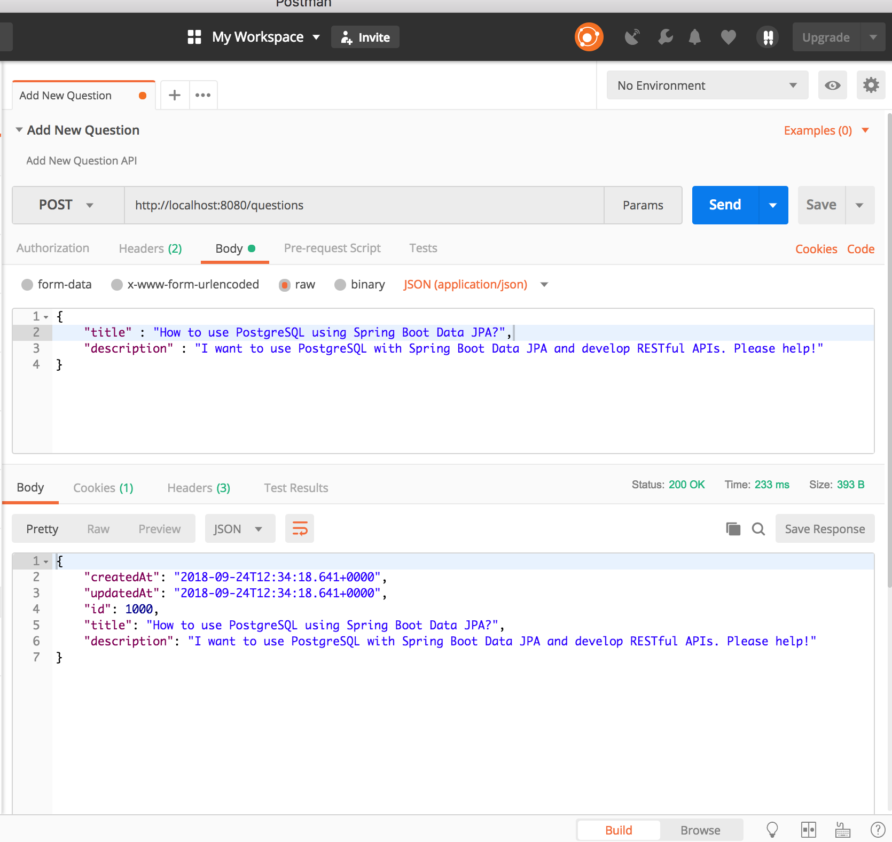
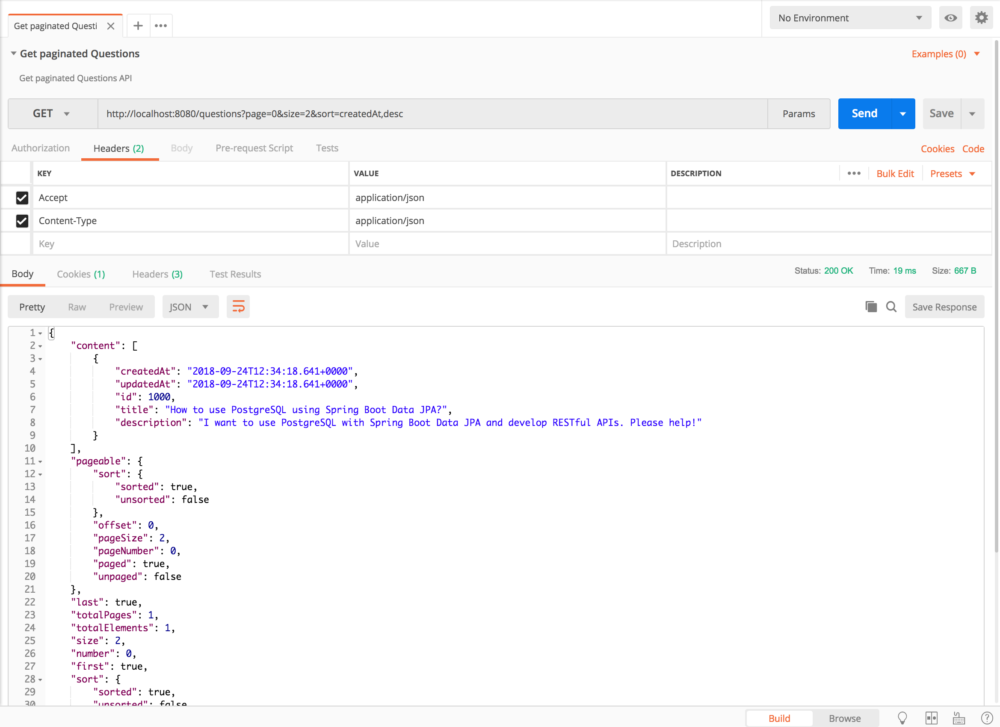
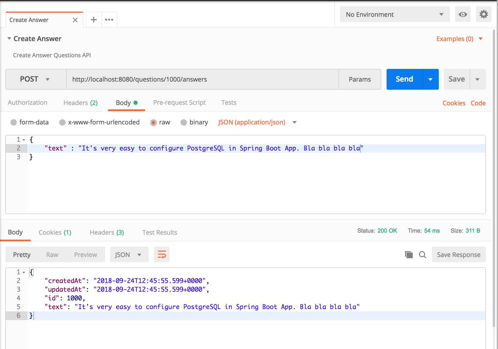
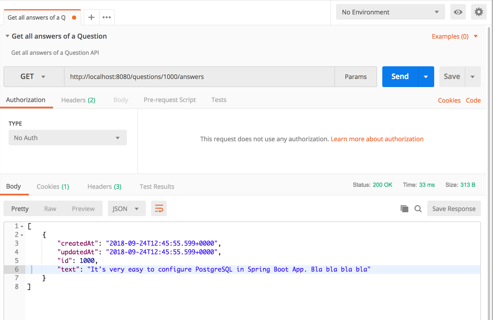

Spring Boot, PostgreSQL, JPA, Hibernate REST API Demo

#### Steps to Setup

## Optional # you can create postgress container and run application manually
docker run --name postgres-db -e POSTGRES_USER=myuser -e POSTGRES_PASSWORD=mypassword -e POSTGRES_DB=mydatabase -p 5432:5432 -d postgres:latest

__1. Configure PostgreSQL__

First, create a database named postgres_demo. Then, open src/main/resources/application.properties file and change the spring datasource username and password as per your PostgreSQL installation.

__2. Run the app__

Type the following command from the root directory of the project to run it -

`mvn clean spring-boot:run`

Alternatively, you can package the application in the form of a JAR file and then run it like so -
```
mvn clean package
java -jar target/spring-boot-postgresql-0.0.1-SNAPSHOT.jar
```

__3. Run app in container
docker-compose up

__4. `mvn clean install` runs test in test container

The application will start on the default port 8080.

The following screenshots show you how to test the APIs using Postman.

__1. Create Question `POST /questions`__



__2. Get paginated Questions `GET /questions?page=0&size=2&sort=createdAt,desc`__



__3. Create Answer `POST /questions/{questionId}/answers`__



__4. Get all answers of a Question `GET /questions/{questionId}/answers`__

